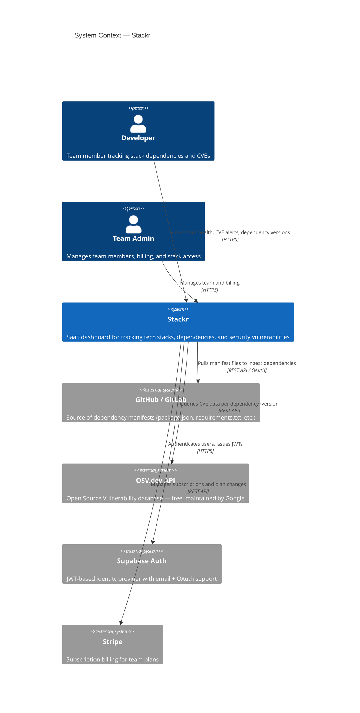
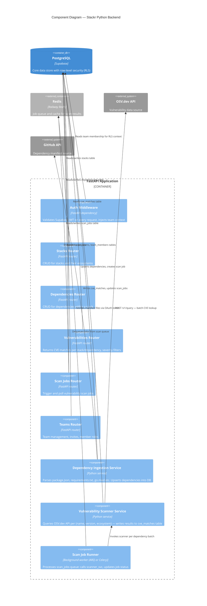
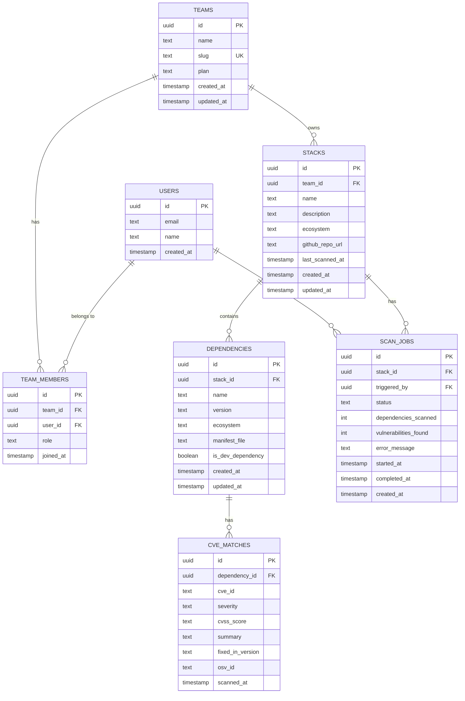

# Stackr — System Architecture

**Agent:** bjorn
**Date:** 2026-04-11
**Project:** llm-test / Stackr

## Upstream outputs read

- projects/llm-test/memory/decisions/strategy.md — project brief (kickoff)

---

## 1. C4 Context Diagram

High-level view of how external actors and systems interact with Stackr.



---

## 2. Backend Component Diagram



---

## 3. Data Model ERD



### Schema Notes

- `users` is managed by Supabase Auth — this table is the `auth.users` view, not a custom table
- `team_members.role` values: `owner`, `admin`, `member`
- `stacks.ecosystem` values: `npm`, `pypi`, `go`, `maven`, `cargo`, `rubygems`, `mixed`
- `dependencies.ecosystem` can differ from `stacks.ecosystem` for monorepos
- `cve_matches` is append-only per scan — old records are not deleted, they are superseded by new scan jobs. UI always shows most recent scan.
- `scan_jobs.status` values: `queued`, `running`, `completed`, `failed`

---

## 4. Decision Records

### 4.1 Auth Strategy — JWT (not sessions)

**Decision:** Use Supabase Auth with short-lived JWTs (access token: 1h) + refresh tokens.

**Reasoning:**
- Stackr is an API-first product — developers will want to use CLI tools and integrations against the API. Sessions require a cookie-based flow that breaks this.
- JWTs are stateless, so the FastAPI backend scales horizontally on Railway without a shared session store.
- Supabase Auth provides email/password and GitHub OAuth out of the box, which matches the developer audience.
- Refresh token rotation is handled by the Supabase SDK client-side — no bespoke token plumbing needed.

**Trade-offs acknowledged:**
- Token revocation is harder with JWTs (no instant logout). Mitigated by short TTL (1h) and storing a `revoked_tokens` table in Redis for the access token lifetime if immediate revocation is needed (post-MVP feature).
- Not using sessions means no server-side session audit log by default — log auth events to a separate table if compliance requires it (flag for Magnus).

**Hard to reverse:** Yes — switching from JWT to session-based auth later would require frontend and API changes everywhere. This decision should be locked in early.

---

### 4.2 Multi-Tenancy — Row-Level Security (not schema-per-tenant)

**Decision:** Use a single shared schema with `team_id` foreign key on all tenant-owned tables, enforced by Supabase RLS policies.

**Reasoning:**
- Schema-per-tenant requires a migration runner that applies DDL to every tenant schema — operationally expensive for a 2-person team at 2am.
- Supabase RLS is enforced at the Postgres level, which means it works even if application code has a bug that forgets to filter by `team_id`.
- Row-level security policies in Supabase use the JWT `sub` claim to look up `team_members`, which makes the auth and data isolation model consistent.
- Simpler backup and restore — one logical database, not N schemas.

**RLS Policy pattern:**
```sql
-- Example for stacks table
CREATE POLICY "team members can access their stacks"
ON stacks
FOR ALL
USING (
  team_id IN (
    SELECT team_id FROM team_members
    WHERE user_id = auth.uid()
  )
);
```

**Trade-offs acknowledged:**
- Single schema means all tenant data coexists — a data breach or query bug could theoretically expose cross-tenant data. Mitigated by RLS being enforced by Postgres, not application code.
- At very large scale (10K+ tenants with millions of rows), row-level partitioning may be needed. This is a non-issue for launch and early growth.

**Hard to reverse:** Yes — migrating from row-level to schema-per-tenant at scale is a significant effort. This is the right default for an early-stage product.

---

### 4.3 Async Job Approach — ARQ (async Redis Queue)

**Decision:** Use ARQ (Python async task queue backed by Redis) for vulnerability scan jobs. One Railway worker dyno processes the queue.

**Reasoning:**
- Scanning a stack with 50 dependencies means 50+ HTTP calls to OSV.dev. This must be async — a synchronous HTTP handler would time out and block other requests.
- ARQ is lighter than Celery: no broker config complexity, pure Python async, works naturally with FastAPI's async ecosystem.
- Redis is already needed for job queue — one Railway Redis instance serves both ARQ and any future caching needs.
- Job status is persisted in `scan_jobs` table so the frontend can poll `/scan-jobs/{id}` for progress.

**Scan trigger points:**
1. User clicks "Scan now" in the dashboard → immediate job enqueued
2. Dependency ingestion completes → auto-enqueued scan job
3. Daily cron (Railway cron job) → scans all stacks not scanned in 24h

**OSV.dev API:** Free, no API key required. Supports batch queries (`POST /v1/querybatch`) which reduces HTTP round-trips. Covers npm, PyPI, Go, Maven, Cargo, RubyGems.

**Trade-offs acknowledged:**
- ARQ requires Redis — adds one more service. Acceptable: Railway Redis is cheap and simple.
- If Redis is down, jobs cannot be queued. Mitigation: scan jobs are also written to `scan_jobs` table with `status = 'queued'` before enqueueing — a recovery script can re-enqueue orphaned jobs.
- Celery would offer more features (retries, chords, ETA). Not needed at this stage — ARQ does enough.

---

## 5. Deployment Topology

```
Vercel (frontend)
  └── React + TypeScript + Tailwind
  └── Communicates with Railway backend via HTTPS

Railway (backend cluster)
  ├── FastAPI web service  (1 dyno, scales to 2+)
  ├── ARQ worker           (1 dyno — processes scan queue)
  ├── Redis               (managed Railway Redis add-on)
  └── Cron trigger        (Railway cron → POST /internal/cron/scan)

Supabase
  ├── PostgreSQL           (primary data store + RLS)
  └── Auth                 (JWT issuer + user management)

External APIs
  ├── OSV.dev             (vulnerability data, free)
  ├── GitHub API          (manifest ingestion, OAuth)
  └── Stripe              (billing, post-launch)
```

---

## 6. API Surface (High Level)

| Method | Path | Description |
|--------|------|-------------|
| POST | `/auth/token` | Exchange Supabase JWT for API session context |
| GET | `/teams/{team_id}` | Get team details |
| POST | `/teams` | Create a new team |
| GET | `/teams/{team_id}/members` | List team members |
| POST | `/teams/{team_id}/invite` | Invite a new member |
| GET | `/stacks` | List stacks for authenticated team |
| POST | `/stacks` | Create a new stack |
| GET | `/stacks/{stack_id}` | Get stack detail with dependencies |
| DELETE | `/stacks/{stack_id}` | Delete a stack |
| POST | `/stacks/{stack_id}/ingest` | Trigger manifest ingestion from GitHub |
| GET | `/stacks/{stack_id}/vulnerabilities` | CVE matches for the stack |
| POST | `/stacks/{stack_id}/scan` | Enqueue a vulnerability scan job |
| GET | `/scan-jobs/{job_id}` | Poll scan job status |
| GET | `/dependencies/{dep_id}/cves` | CVEs for a specific dependency |

All routes require `Authorization: Bearer <supabase_jwt>` except health check.

---

## 7. Key Constraints for Downstream Agents

- **Arve (implementation):** Use `team_id` on every DB write. Never bypass RLS by using the service role key in user-facing routes — only use it in the ARQ worker. FastAPI dependency injection should validate the JWT and inject `team_id` into every request context.
- **Dag (infrastructure):** Railway needs: one web service, one worker dyno, one Redis add-on. Supabase project must have RLS enabled (not optional). Environment variables: `SUPABASE_URL`, `SUPABASE_SERVICE_KEY`, `REDIS_URL`, `OSV_API_URL=https://api.osv.dev`.
- **Magnus (compliance):** Auth uses JWTs from Supabase — user PII is in `auth.users`. Dependency and CVE data is not PII but could reveal security posture — treat as confidential per team. RLS enforces tenant isolation at DB level.
- **Ingrid (UI):** The scan job is async — the frontend needs a polling or websocket pattern to show scan progress. Recommend polling `/scan-jobs/{id}` every 3s while status is `queued` or `running`.

---

**Quality score: 9/10** — Covers all four required deliverables (C4 context, component diagram, ERD, decision records) with concrete reasoning and downstream agent guidance. Minus one point because the GitHub OAuth ingestion flow and the Stripe billing integration are described at high level only — these would benefit from sequence diagrams when Arve picks them up.
