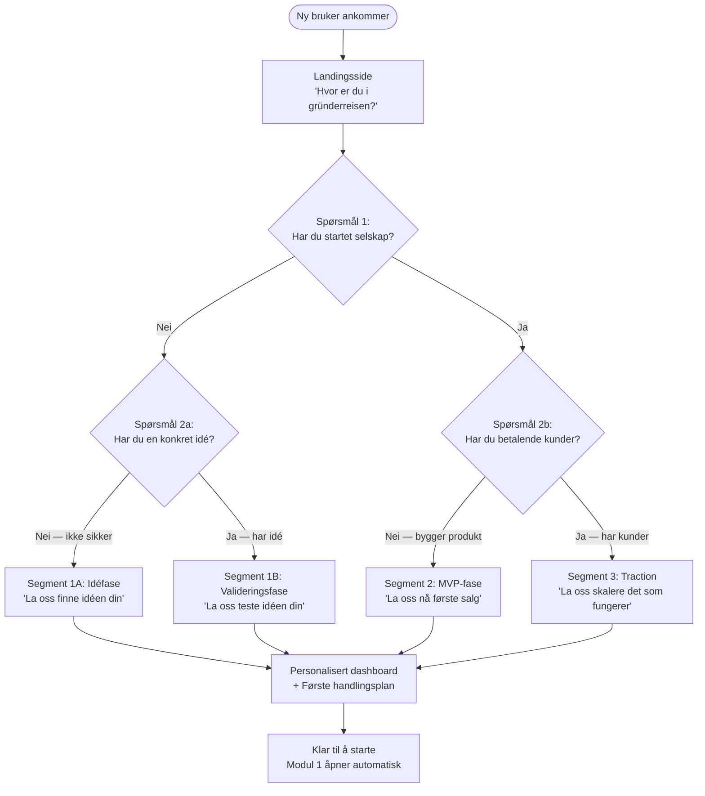
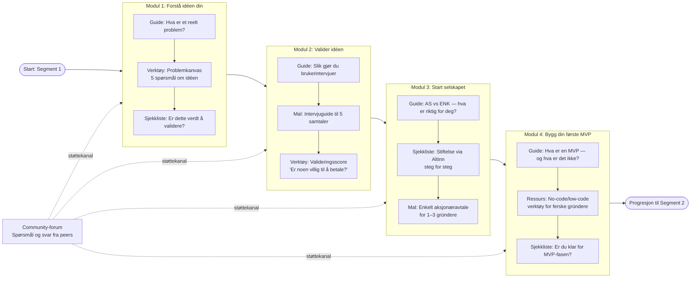
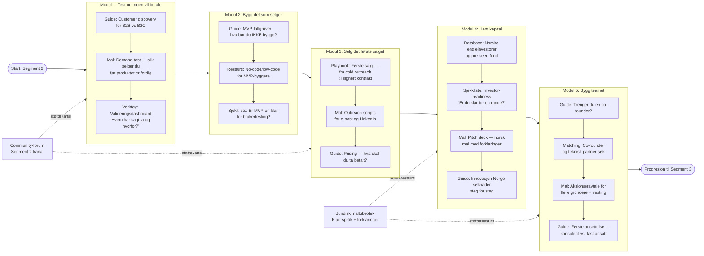
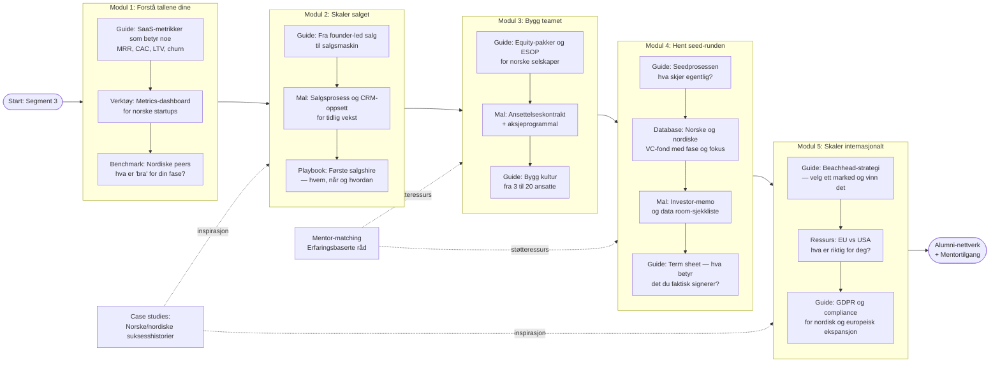
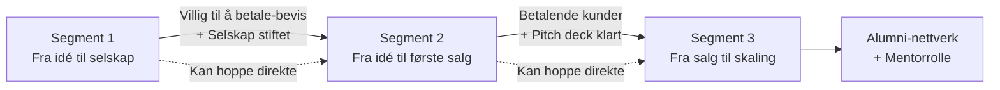

# Innholdsstruktur og brukerreise — 6AM Startup Studio

**Agent:** ingrid  
**Dato:** 2026-04-08  
**Prosjekt:** 6AM — Gratis digitalt tilbud for tidligfasegründere i Norge

---

## Upstream outputs read

- `projects/6am/output/2026-04-08-segment-research-needs-analysis.md` (else)

---

## Sammendrag

Dette dokumentet definerer informasjonsarkitekturen og brukerreisen for 6AM sitt digitale tilbud. Basert på else sin segmentanalyse designer jeg tre distinkte brukerreiser — én per segment — med et felles onboarding-punkt. Hvert segment har en klar modulstruktur med prioritert innhold, konkrete ressursformater, og tydelig progresjon. Målet er at brukeren opplever verdi innen de første fem minuttene.

**Designprinsipper:**
- Sekvensering over mengde — kurasjon er produktet
- Verdi innen < 5 min etter innlogging
- Ingen dead ends — alltid ett tydelig neste steg
- Gjennomgående dark mode-støtte, Tailwind-inspirert layout
- Data-forward: fremdrift og progress skal vises tydelig

---

## Del 1: Overordnet onboarding-flyt

Alle nye brukere starter på samme inngangsside. Tre til fire spørsmål plasserer dem i riktig segment og personaliserer dashboardet. Onboarding er ikke en kursmodul — det er en skanning som gir brukeren en umiddelbar handlingsplan.



**Onboarding-spørsmål (maks 4):**
1. "Har du startet et selskap?" (Ja / Nei)
2a. (Hvis nei) "Har du en konkret idé du ønsker å jobbe med?" (Har idé / Ikke ennå)
2b. (Hvis ja) "Har du betalende kunder?" (Ja / Bygger fremdeles produkt)

Resultat: Brukeren lander på et personalisert dashboard med én klar anbefaling øverst.

---

## Del 2: Brukerreise — Segment 1: Ferske gründere

**Persona:** Har en idé (eller ikke ennå). Kanskje i jobb ved siden av. Usikker på hva neste steg er.  
**Mål:** Gå fra idé til validert konsept og stiftet selskap.  
**Kritisk suksessfaktor:** Brukeren skal aldri lure på "hva gjør jeg nå?"



**Innholdskart — Segment 1:**

| Modul | Type | Format | Prioritet |
|-------|------|---------|-----------|
| Problemkanvas (5 spørsmål) | Interaktivt verktøy | Innebygd i plattformen | Kritisk |
| Guide: Hva er et reelt problem? | Kortformat guide | 5–8 min lesing | Kritisk |
| Intervjuguide til 5 samtaler | Nedlastbar mal | PDF + Google Docs-kopi | Kritisk |
| AS vs ENK — beslutningsguide | Artikkel + beslutningstre | 10 min lesing | Høy |
| Stiftelse via Altinn — steg for steg | Sjekkliste | Interaktiv sjekkliste | Høy |
| Enkelt aksjonæravtale (1–3 gründere) | Juridisk mal | Word + forklaringer | Høy |
| Hva er en MVP? | Kortformat guide | 5 min lesing | Middels |
| No-code/low-code verktøyoversikt | Ressursliste | Kurert liste med forklaringer | Middels |
| Community-forum (segment 1-kanal) | Community | Slack / innebygd forum | Middels |

**Progresjonskriterier til Segment 2:**
- Fullført 5 brukerintervjuer (med mal)
- Validert at minst én person er villig til å bruke/betale
- Selskap stiftet

---

## Del 3: Brukerreise — Segment 2: Produktbyggere / MVP-fase

**Persona:** Har selskap. Bygger aktivt produkt. Har kanskje tidlige brukere, men ingen betalende kunder ennå.  
**Mål:** Første betalende kunde og investor-readiness.  
**Kritisk suksessfaktor:** Brukeren skal selge, ikke bare bygge.



**Innholdskart — Segment 2:**

| Modul | Type | Format | Prioritet |
|-------|------|---------|-----------|
| Demand-test — selg før du bygger | Mal + guide | 10 min guide + nedlastbar mal | Kritisk |
| Første salg — playbook | Playbook | Steg-for-steg guide (15–20 min) | Kritisk |
| Outreach-scripts (e-post + LinkedIn) | Maler | 5–8 ferdigskrevne maler | Kritisk |
| Investor-readiness sjekkliste | Sjekkliste | Interaktiv sjekkliste | Kritisk |
| Norsk investordatabase (pre-seed/seed) | Database | Filtrert, oppdatert liste | Høy |
| Pitch deck mal — norsk | Mal | Google Slides + PPT | Høy |
| Innovasjon Norge-guide (SkatteFUNN, etablerertilskudd) | Guide | 15 min guide + søknads-eksempel | Høy |
| Aksjonæravtale med vesting | Juridisk mal | Word + forklaringer | Høy |
| Co-founder matching | Verktøy | Profil + match-funksjon | Høy |
| Prising — hva skal du ta betalt? | Guide | 8 min + regneark | Middels |
| MVP-fallgruver | Artikkel | 5–8 min lesing | Middels |
| Første ansettelse — konsulent vs. fast | Guide | 8 min lesing + mal | Middels |

**Progresjonskriterier til Segment 3:**
- Minst én betalende kunde
- Pitch deck ferdigstilt
- Selskap med minimum to personer (eller alene med klar plan)

---

## Del 4: Brukerreise — Segment 3: Gründere med traction

**Persona:** Har betalende kunder og/eller MRR. Ser vekstpotensial. Trenger å skalere — team, kapital og salgsmaskin.  
**Mål:** Seed-runde, skalerbart salgssystem, og første strategiske ansettelser.  
**Kritisk suksessfaktor:** Innholdet her er operasjonelt, ikke pedagogisk — brukeren vil ha verktøy, ikke kurs.



**Innholdskart — Segment 3:**

| Modul | Type | Format | Prioritet |
|-------|------|---------|-----------|
| SaaS metrics-guide (MRR, CAC, LTV, churn) | Guide + regneark | 15 min guide + Google Sheets-mal | Kritisk |
| Nordisk startup metrics benchmark | Data-rapport | Interaktivt dashboard | Kritisk |
| Seedprosessen — steg for steg | Guide | 20 min guide | Kritisk |
| Norske og nordiske VC-fond — database | Database | Filtrert etter fase/sektor/geografi | Kritisk |
| Investor-memo og data room-mal | Mal-pakke | Nedlastbar mal-pakke | Høy |
| Term sheet — ordbok og fallgruver | Guide | 10 min lesing + eksempel-term sheet | Høy |
| ESOP og equity-pakker for norske selskaper | Guide + mal | 15 min guide + regneark | Høy |
| Fra founder-led salg til salgsmaskin | Playbook | 20 min guide | Høy |
| Beachhead-strategi | Guide | 10 min + beslutningstre | Middels |
| Mentor-matching | Verktøy | Profil + match-funksjon | Middels |
| Case studies: Norske/nordiske suksesshistorier | Innhold | 5–8 dybdeintervjuer per år | Middels |
| Bygg kultur fra 3 til 20 ansatte | Guide | 10 min lesing | Lav (men unikt) |

**Etter Segment 3:**
- Alumni-nettverk — lukket community for gründere som har hentet seed+
- Mentortilgang — mulighet til å bli mentor for Segment 1/2-brukere
- Deal flow til 6AM som investorpartner (Nora sin freemium-trapp)

---

## Del 5: Informasjonsarkitektur — Overordnet plattformstruktur

```mermaid
graph TD
    NAV[Navigasjon] --> DASHBOARD[Dashboard\nPersonalisert per segment]
    NAV --> LEARN[Lær\nModuler og guider]
    NAV --> TOOLS[Verktøy\nMaler, sjekklister, databaser]
    NAV --> COMMUNITY[Community\nForum og matching]
    NAV --> PROFILE[Profil\nFramgang og notater]

    DASHBOARD --> MYPATH[Min reise\nNåværende modul + neste steg]
    DASHBOARD --> PROGRESS[Fremdrift\nFullførte moduler]
    DASHBOARD --> RECOMMENDED[Anbefalt for deg\nPersonalisert innhold]

    LEARN --> SEG1[Segment 1-spor:\nFra idé til selskap]
    LEARN --> SEG2[Segment 2-spor:\nFra idé til første salg]
    LEARN --> SEG3[Segment 3-spor:\nFra salg til skaling]

    TOOLS --> TEMPLATES[Malbibliotek\nJuridisk, pitch, salg]
    TOOLS --> DATABASES[Databaser\nInvestorer, mentorer, verktøy]
    TOOLS --> CHECKLISTS[Sjekklister\nValidering, investor-readiness]
    TOOLS --> CALCULATORS[Kalkulatorer\nUnit economics, cap table]

    COMMUNITY --> FORUM[Forum\nSegment-inndelt]
    COMMUNITY --> MATCHING[Matching\nCo-founder + mentor]
    COMMUNITY --> EVENTS[Arrangementer\nWebinarer og meetups]

    PROFILE --> NOTES[Mine notater]
    PROFILE --> SAVED[Lagrede ressurser]
    PROFILE --> SEGMENT[Mitt segment\nKan oppdateres]
```



**Primær navigasjon (5 elementer, maksimalt):**
- Dashboard
- Lær
- Verktøy
- Community
- Profil

**Dashboardprioritet:** "Neste steg" er alltid synlig øverst på dashboardet. Brukeren skal aldri lete etter hva de bør gjøre.

---

## Del 6: Innholdsformater og produksjonsprioritering

### Formater per innholdstype

| Innholdstype | Anbefalt format | Begrunnelse |
|-------------|-----------------|-------------|
| Guider | Strukturert artikkel (700–1500 ord) | Lett å produsere og holde oppdatert |
| Playbooks | Steg-for-steg artikkel med eksempler | Operasjonelt, ikke pedagogisk |
| Maler | Google Docs/Sheets-kopi + PDF | Gründere kan bruke det med én gang |
| Sjekklister | Interaktiv i plattformen | Fremdriftsindikasjon og engagement |
| Databaser | Tabell med filtrering | Oppdateres løpende — dette er differensiering |
| Video | 3–8 min per emne, innebygd | Supplement til tekst — ikke erstatning |
| Case studies | Intervjuformat, 1000–1500 ord | Inspirasjon + social proof |
| Community | Slack eller innebygd forum | Asynkront, lavterskel |

### MVP-innholdsprioritering (hva bygges først)

**Fase 1 — Kritisk (bygg før lansering):**
1. Onboarding-flyt med segment-spørsmål (interaktiv)
2. Problemkanvas-verktøy (Segment 1)
3. Intervjuguide-mal (Segment 1)
4. AS vs ENK-guide + Altinn-sjekkliste (Segment 1)
5. Første salg-playbook (Segment 2)
6. Outreach-scripts x5 (Segment 2)
7. Investor-readiness sjekkliste (Segment 2)
8. Norsk investordatabase pre-seed/seed (Segment 2)
9. SaaS metrics-guide + Google Sheets-mal (Segment 3)
10. Norsk VC-database (Segment 3)

**Fase 2 — Høy verdi (bygg i løpet av de første 3 månedene):**
- Pitch deck-mal (norsk)
- Juridisk malbibliotek (aksjonæravtale, ansettelse, ESOP)
- Co-founder matching-verktøy
- Metrics-dashboard
- Community-forum (Slack eller innebygd)

**Fase 3 — Differensiering (bygg når traction er bekreftet):**
- Mentor-matching
- Nordiske peer benchmarks
- Case studies
- Investor-memo og data room-mal
- Webinarer og live events

---

## Del 7: Progressjon mellom segmenter

Brukere beveger seg gjennom plattformen langs en naturlig gründerreise. Progresjon bør ikke kreve godkjenning — brukeren velger selv å gå videre. Men plattformen guider aktivt ved å vise "du er nesten klar for neste fase"-meldinger.



**Progresjonsprinsipper:**
- Ingen tvungen lineæritet — gründere vet best selv
- Dashboard viser fremdrift visuelt (% fullført per segment)
- "Neste anbefaling" oppdateres automatisk basert på fullført innhold
- Segment kan endres fra profilsiden når som helst
- Plattformen sender én ukentlig e-post med "neste steg" — ikke nyhetsbrev

---

## Del 8: UX-anbefalinger og designprinsipper

### Dashboardlayout (desktop — primær)

```
┌────────────────────────────────────────────────────────────┐
│  6AM                          [Verktøy] [Community] [Profil]│
├────────────────────────────────────────────────────────────┤
│                                                            │
│  Hei, [Navn].                                              │
│  Du er i Segment 2 — MVP-fasen.                            │
│                                                            │
│  ┌──────────────────────────────────┐  ┌────────────────┐  │
│  │ NESTE STEG                       │  │ FREMDRIFT      │  │
│  │                                  │  │                │  │
│  │ Modul 3: Selg det første salget  │  │ Seg 1  ████░  │  │
│  │ "Lær å selge før du er ferdig"   │  │ Seg 2  ██░░░  │  │
│  │                                  │  │                │  │
│  │ [Start modul →]                  │  │ 3/8 moduler    │  │
│  └──────────────────────────────────┘  └────────────────┘  │
│                                                            │
│  ANBEFALT FOR DEG                                          │
│  ┌───────────┐  ┌───────────┐  ┌───────────┐              │
│  │ Outreach- │  │ Investor- │  │ Aksjonær- │              │
│  │ scripts   │  │ database  │  │ avtale    │              │
│  │ [Mal]     │  │ [Liste]   │  │ [Mal]     │              │
│  └───────────┘  └───────────┘  └───────────┘              │
└────────────────────────────────────────────────────────────┘
```

**UX-regler som ikke skal fravikes:**
- "Neste steg" er alltid synlig og klar — ingen skjulte handlinger
- Maksimalt 3 klikk til enhver kjernefunksjon
- Ingen onboarding-kurs på 20+ moduler — innhold er sekvensert, ikke dumpet
- Tom-state: nye brukere ser et tomt dashboard med tydelig call-to-action, ikke en tom liste
- Loading state: skjelett-UI, ikke spinner — brukeren ser strukturen mens data laster
- Error state: klart og handlingsbart — "Vi klarte ikke laste investordatabasen. [Prøv igjen]"
- Mobil: dashboardet fungerer på mobil, men verktøy/maler er primært desktop

### Dark mode-spesifikasjon (Tailwind-klasser)
- Bakgrunn: `bg-zinc-950` / `bg-zinc-900` (kortbakgrunn)
- Tekst: `text-zinc-100` (primær) / `text-zinc-400` (sekundær)
- Aksent: `text-indigo-400` / `bg-indigo-600` (CTA-knapper)
- Border: `border-zinc-800`
- Progress: `bg-indigo-500` på `bg-zinc-800`

---

## Konklusjon og neste steg

6AM sitt digitale tilbud bør lansere med:

1. **En klar onboarding-flyt** som plasserer brukeren i riktig segment på under 2 minutter
2. **10 kritiske innholdselementer** — fordelt på de tre segmentene (se Fase 1 over)
3. **Et dashboard** der "neste steg" alltid er synlig
4. **En investordatabase** som differensierer fra alle norske konkurrenter
5. **Et community** (Slack til å begynne med) som gir brukeren en plass å stille spørsmål

Det er ikke mengden innhold som avgjør om 6AM lykkes — det er om brukeren finner den ene ressursen som hjelper dem ta det neste steget. Kurasjon og sekvensering er selve produktet.

---

*Rapport levert av: ingrid*  
*Dato: 2026-04-08*  
*Neste steg: frode (prioritering og handlingsplan)*
