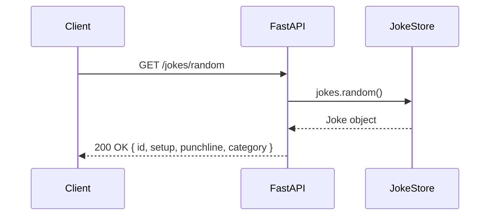

# System Architecture — Joke REST API

**Agent:** bjorn
**Date:** 2026-04-06
**Project:** auto-dispatch-test

---

## Upstream outputs read

None — this is a Phase 1 document. No upstream outputs required.

---

## Overview

A simple single-endpoint REST API that returns a random joke. Stateless, no auth required, no database — jokes are bundled in-process as a static dataset. Designed for a 2-person team to maintain at 2am.

---

## Tech Stack

| Layer | Choice | Rationale |
|-------|--------|-----------|
| Language | Python 3.11 | Team standard, fast to iterate |
| Framework | FastAPI | Async-capable, auto-generates OpenAPI docs, minimal boilerplate |
| Data storage | In-process list (JSON file bundled with app) | No database needed for a static joke dataset; eliminates ops overhead |
| Hosting | Railway | Team standard for backend |
| Testing | pytest + httpx | Standard FastAPI testing pattern |

---

## Data Model

Each joke has four fields:

```json
{
  "id": 1,
  "setup": "Why don't scientists trust atoms?",
  "punchline": "Because they make up everything.",
  "category": "science"
}
```

| Field | Type | Description |
|-------|------|-------------|
| `id` | integer | Unique identifier |
| `setup` | string | The joke question or premise |
| `punchline` | string | The punchline |
| `category` | string | Category tag (e.g. `science`, `food`, `general`) |

Jokes are stored in `data/jokes.json`, loaded once at startup.

---

## API Design

### `GET /jokes/random`

Returns a single randomly selected joke.

**Response — 200 OK:**

```json
{
  "id": 7,
  "setup": "Why did the scarecrow win an award?",
  "punchline": "Because he was outstanding in his field.",
  "category": "general"
}
```

**Response — 500 Internal Server Error** (only if joke list is empty):

```json
{
  "detail": "No jokes available."
}
```

### `GET /health`

Liveness check for Railway and CI.

**Response — 200 OK:**

```json
{
  "status": "ok"
}
```

---

## Request/Response Flow



---

## Project Directory Structure

```
joke-api/
├── app/
│   ├── main.py          # FastAPI app, route definitions
│   ├── models.py        # Pydantic response model for Joke
│   └── jokes.py         # Joke loading and random selection logic
├── data/
│   └── jokes.json       # Static joke dataset (bundled with app)
├── tests/
│   └── test_jokes.py    # pytest tests for the endpoint
├── Dockerfile
├── docker-compose.yml
├── requirements.txt
└── .github/
    └── workflows/
        └── ci.yml       # GitHub Actions: lint + test on push
```

---

## Key Decisions

| Decision | Choice | Why |
|----------|--------|-----|
| Static dataset vs DB | Static JSON file | No write operations needed; eliminates DB ops cost and latency |
| Framework | FastAPI over Flask | Auto-docs, Pydantic validation, async support — same simplicity |
| No pagination/filtering | Out of scope for v1 | Single random endpoint is the full spec; add later if needed |

**Hard-to-reverse decision:** Loading jokes as a static in-process list means scaling to a mutable joke database later requires a data migration and new endpoint logic. Acceptable for this project scope.

---

## What Dag Needs (Infrastructure)

- Dockerfile for the FastAPI app
- docker-compose.yml for local dev
- GitHub Actions CI: run `pytest` on push to `main`
- Railway deployment config (or notes on environment variables)

## What Arve Needs (Implementation)

- Implement `app/main.py`, `app/models.py`, `app/jokes.py`
- Populate `data/jokes.json` with at least 20 jokes
- Write `tests/test_jokes.py` covering: happy path, response schema, category field present

## What Odd Needs (API Tests)

- Base URL from Dag's deployment
- Test `GET /jokes/random` returns valid schema on each call
- Test `GET /health` returns `{"status": "ok"}`
