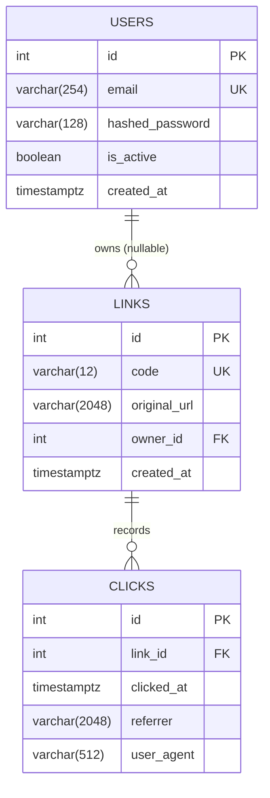
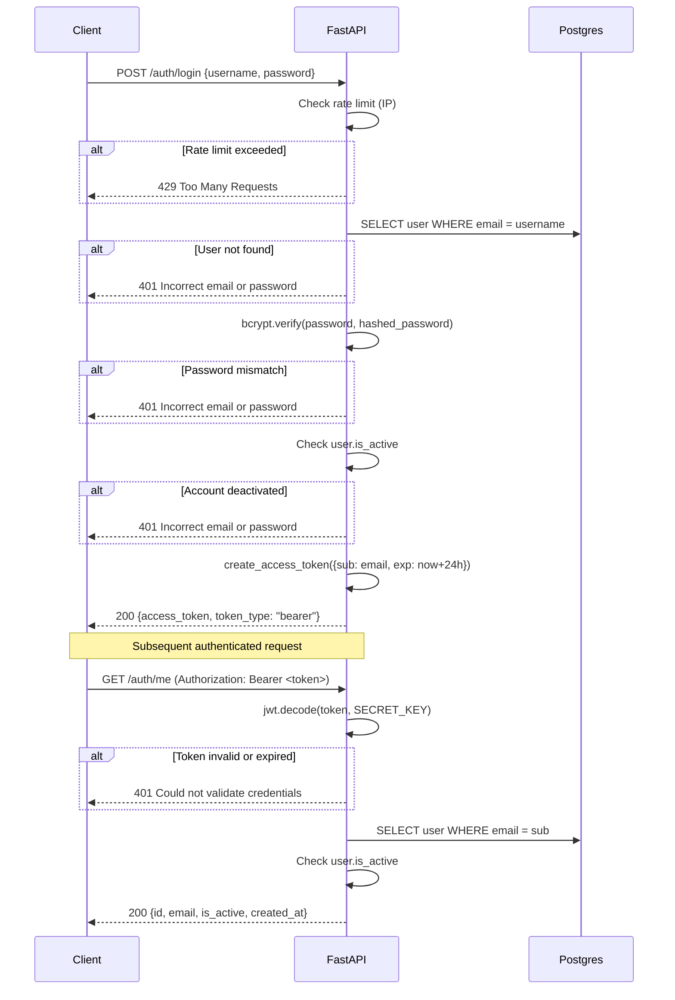
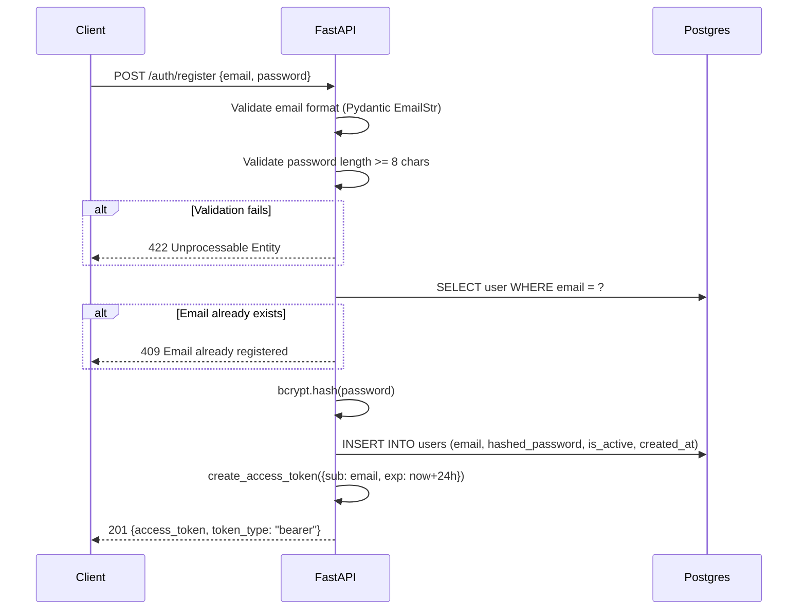

# Authentication System Architecture — URL Shortener

**Agent:** bjorn
**Date:** 2026-04-01
**Status:** Complete

---

## Overview

This document specifies the authentication architecture for the URL shortener service. It covers data models, API endpoint contracts, the chosen auth strategy with rationale, security requirements, and diagrams. Downstream agents (arve for implementation, dag for infrastructure/secrets, magnus for compliance) should treat this as the reference spec.

The system supports two user states: anonymous (no account) and authenticated. Anonymous users can create links; authenticated users own their links and can manage them. Auth is additive — no existing anonymous behavior breaks when auth is introduced.

---

## 1. Auth Strategy Decision: JWT Access Tokens (Stateless)

**Decision: JWT Bearer tokens with HS256 signing. No server-side session storage. No refresh tokens at launch.**

### Rationale

The service runs on FastAPI (stateless process) deployed to Railway. There is no existing Redis or session store wired to the auth layer — only the Postgres database (Supabase). Adding a separate session store (Redis) solely for auth creates operational complexity that a two-person team does not need at this stage.

JWT access tokens are a natural fit because:
- FastAPI has first-class OAuth2/Bearer support via `fastapi.security`
- Tokens are self-contained — no DB round-trip to validate on every request
- Stateless validation scales horizontally without coordination overhead
- Standard tooling (python-jose, passlib) handles signing and hashing

**On refresh tokens:** Omitted at launch. A 24-hour access token expiry balances security and UX for an early product. Refresh tokens add a revocation problem: to invalidate a compromised refresh token you need a server-side blocklist, which reintroduces state. Revisit when the team has a concrete need (e.g. mobile clients, enterprise sessions).

**Hard-to-reverse flag:** Choosing stateless JWT now means token revocation (e.g. logout invalidating a token server-side) is not possible without adding a blocklist later. This is acceptable for a URL shortener with short-lived tokens, but should be documented. If the product evolves to require instant revocation (e.g. security incident response, admin-forced logout), a Redis blocklist must be introduced.

---

## 2. Data Models

### 2.1 Users Table

```sql
CREATE TABLE users (
    id           SERIAL PRIMARY KEY,
    email        VARCHAR(254) NOT NULL UNIQUE,
    hashed_password VARCHAR(128) NOT NULL,
    is_active    BOOLEAN NOT NULL DEFAULT TRUE,
    created_at   TIMESTAMPTZ NOT NULL DEFAULT NOW()
);

CREATE INDEX idx_users_email ON users(email);
```

**Notes:**
- `email` is the primary identity claim in the JWT `sub` field. Email must be unique and indexed — auth lookups happen on every protected request.
- `hashed_password` stores only the bcrypt hash, never the plaintext.
- `is_active` allows soft-disable without deletion. Deactivated users receive 401 on login; their links remain owned and intact.
- No `username` field — email-only login keeps registration friction low and avoids a second unique constraint.

### 2.2 Links Table (Updated)

```sql
-- Existing table, owner_id column added
ALTER TABLE links
    ADD COLUMN owner_id INTEGER REFERENCES users(id) ON DELETE SET NULL;

CREATE INDEX idx_links_owner_id ON links(owner_id);
```

**Notes:**
- `owner_id` is nullable. NULL means the link was created anonymously and has no owner.
- `ON DELETE SET NULL`: if a user account is deleted, their links become anonymous rather than cascade-deleted. This preserves redirect functionality (broken short links are worse than orphaned ones). Revisit this policy if GDPR deletion requirements demand full erasure — that is a product and legal decision, not purely an engineering one.

### 2.3 Token Storage

No server-side token table. Tokens are stateless JWTs. The client (browser, API consumer) holds the token in memory or localStorage. Logout is client-side token discard only.

If a server-side blocklist is needed in future, add:

```sql
CREATE TABLE revoked_tokens (
    jti      VARCHAR(64) PRIMARY KEY,  -- JWT ID claim
    revoked_at TIMESTAMPTZ NOT NULL DEFAULT NOW(),
    expires_at TIMESTAMPTZ NOT NULL    -- prune rows after expiry
);
```

This table is not required at launch.

---

## 3. API Endpoint Specification

All auth endpoints are prefixed with `/auth/` to namespace them clearly and allow future versioning or routing splits.

### 3.1 POST /auth/register

Register a new user account.

**Request body:**
```json
{
  "email": "user@example.com",
  "password": "plaintext-password"
}
```

**Response 201:**
```json
{
  "access_token": "<jwt>",
  "token_type": "bearer"
}
```

**Errors:**
| Status | Condition |
|--------|-----------|
| 409 | Email already registered |
| 422 | Invalid email format or missing fields |

**Notes:** Return a token immediately on register so the client does not need a second login round-trip. Validate email format with Pydantic `EmailStr`. Do not expose whether an email exists before registration — the 409 is acceptable here because the user just tried to register with it.

**Password validation** (enforced server-side, not just client-side):
- Minimum 8 characters
- No maximum (bcrypt handles long inputs via 72-byte truncation — document this to implementer)

### 3.2 POST /auth/login

Authenticate an existing user.

**Request:** `application/x-www-form-urlencoded` (OAuth2 password flow standard)
```
username=user@example.com&password=plaintext-password
```

Note: The OAuth2 spec names the field `username` even when it holds an email. This allows FastAPI's `OAuth2PasswordRequestForm` and the built-in Swagger UI "Authorize" button to work without custom tooling.

**Response 200:**
```json
{
  "access_token": "<jwt>",
  "token_type": "bearer"
}
```

**Errors:**
| Status | Condition |
|--------|-----------|
| 401 | Email not found or password incorrect — always use the same message, never distinguish |
| 429 | Rate limit exceeded (5 failed attempts per 15 minutes per IP) |

### 3.3 POST /auth/logout

Client-side logout only. The server does not invalidate the token (see stateless JWT decision above).

**Response 200:**
```json
{
  "detail": "Logged out"
}
```

This endpoint exists so the frontend has a consistent logout action URL and so a future blocklist implementation has a clear hook point. It currently does nothing server-side.

### 3.4 GET /auth/me

Return the authenticated user's profile.

**Headers:** `Authorization: Bearer <token>`

**Response 200:**
```json
{
  "id": 1,
  "email": "user@example.com",
  "is_active": true,
  "created_at": "2026-04-01T12:00:00Z"
}
```

**Errors:**
| Status | Condition |
|--------|-----------|
| 401 | Missing or invalid token |

---

## 4. Security Considerations

### 4.1 Password Hashing

Use bcrypt via `passlib[bcrypt]`. Never roll a custom hashing scheme.

```python
pwd_context = CryptContext(schemes=["bcrypt"], deprecated="auto")
```

- Work factor: passlib default (12 rounds). Do not reduce this.
- bcrypt silently truncates inputs at 72 bytes. If accepting very long passwords, this is a known limitation — document it but do not add pre-hashing (that introduces other issues).

### 4.2 JWT Configuration

```
Algorithm:    HS256
Secret key:   min 256-bit random key, injected via environment variable JWT_SECRET_KEY
Expiry:       24 hours (ACCESS_TOKEN_EXPIRE_MINUTES = 1440)
Claims:       sub (email), exp (expiry timestamp)
```

**Secret key management:** The secret must be generated with a CSPRNG (e.g. `openssl rand -hex 32`) and stored as a Railway environment variable. It must never appear in source code or be committed to git. Dag is responsible for provisioning this secret.

**HS256 vs RS256:** HS256 (symmetric) is sufficient for a single-service backend. RS256 (asymmetric) is needed only when multiple independent services need to verify tokens without sharing a secret. Not needed now.

### 4.3 Rate Limiting on Login

The `/auth/login` endpoint is the primary brute-force target. Rate limiting is required before the service goes public.

**Recommended approach:** SlowAPI (starlette-based, Railway-compatible) with Redis as the backend. Limit: 5 requests per 15-minute window per IP.

```python
# Sketch — implementation detail for arve/dag
limiter = Limiter(key_func=get_remote_address)
@app.post("/auth/login")
@limiter.limit("5/15minutes")
def login(...): ...
```

If Redis is not available at launch, fall back to in-memory rate limiting with the understanding that it resets on process restart and does not coordinate across multiple instances. Document this limitation.

**Hard-to-reverse flag:** If Railway auto-scales to multiple instances, in-memory rate limiting becomes ineffective. Redis-backed rate limiting must be in place before any horizontal scaling occurs.

### 4.4 Additional Security Requirements

- **HTTPS only:** All auth endpoints must be served over TLS. Railway provides this automatically. Never allow plaintext auth.
- **Timing-safe comparison:** passlib's `verify` is already timing-safe. Do not compare password hashes with `==`.
- **Error messages:** Login errors must never reveal whether the email exists. Use a single generic message: "Incorrect email or password."
- **is_active check:** After token validation, check `user.is_active` before granting access. A deactivated account should return 401 even with a valid token.
- **CORS:** Configure CORS to allow only the known frontend origin(s). Do not use wildcard `*` in production.

---

## 5. ER Diagram



---

## 6. Login Flow — Sequence Diagram



---

## 7. Registration Flow — Sequence Diagram



---

## 8. Decisions Summary

| Decision | Choice | Rationale | Reversibility |
|----------|--------|-----------|---------------|
| Auth strategy | Stateless JWT (HS256) | No session store needed, FastAPI native support | Medium — switching to sessions later requires state infrastructure |
| Password hashing | bcrypt via passlib | Industry standard, timing-safe, configurable work factor | High |
| Token expiry | 24 hours | Balance of UX and security for a URL shortener | High |
| Refresh tokens | Omitted at launch | Adds revocation complexity not yet needed | High — add later if needed |
| owner_id on DELETE | SET NULL | Preserve redirect functionality over strict ownership | Medium — changing to CASCADE requires a data migration |
| Rate limiting | 5 req / 15 min / IP via SlowAPI | Simple, Railway-compatible | High |
| Token revocation | Not implemented | Stateless; revisit if instant invalidation needed | Medium — requires Redis blocklist table |

---

## 9. Notes for Downstream Agents

**For arve (implementation):**
- Auth endpoints should be grouped under `/auth/` prefix (current implementation has them at root — recommend moving to maintain clean API structure as the service grows)
- The `is_active` field needs to be added to the User model and checked in `get_current_user`
- Password minimum length validation should be enforced in the Pydantic schema, not just client-side
- `GET /auth/me` endpoint is not yet implemented — needed for the frontend profile/dashboard

**For dag (infrastructure/secrets):**
- `JWT_SECRET_KEY` must be provisioned as a Railway environment variable before any deployment
- Generate with: `openssl rand -hex 32`
- Rate limiting with SlowAPI requires a Redis URL if multi-instance is anticipated; document whether a single Railway instance is the plan at launch
- Do not commit any secret to git under any circumstance

**For magnus (compliance):**
- Passwords are hashed with bcrypt — plaintext never stored or logged
- No PII is stored in JWT tokens beyond the user's email address in the `sub` claim
- Token expiry (24h) limits exposure window from token theft
- Account deactivation (`is_active = false`) allows disabling access without deletion — supports right-to-restrict requests
- Full account deletion requires a separate mechanism (not in this scope) — see GDPR DSR requirements
