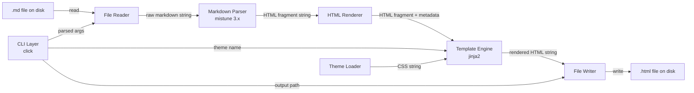
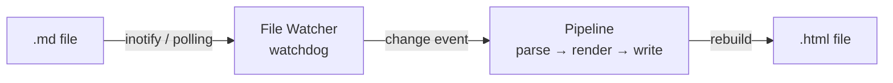

# System Architecture — Markdown-to-HTML Converter CLI

**Agent:** bjorn  
**Date:** 2026-04-07  
**Project:** neutral

---

## Upstream outputs read

None required — this is a greenfield architecture task.

---

## Overview

A command-line tool that accepts a Markdown file as input and produces a self-contained, styled HTML file as output. The design prioritises simplicity, zero runtime dependencies for end-users, and a clean separation between parsing, rendering, and CLI concerns.

**Chosen language: Python 3.11+**

Rationale: consistent with the team's established backend stack (Python + FastAPI). A Node.js implementation would require a separate runtime and toolchain. Python's standard library handles most of the plumbing; only the Markdown parser is a third-party dependency.

---

## Data Flow



### Watch mode addition



---

## Module Breakdown

```
md2html/
├── __main__.py        # entry point: python -m md2html
├── cli.py             # CLI layer — argument parsing, flag validation
├── reader.py          # reads .md file from disk, returns string
├── parser.py          # wraps mistune, returns HTML fragment
├── renderer.py        # assembles full HTML: fragment + metadata + theme CSS
├── writer.py          # writes final HTML string to output path
├── watcher.py         # --watch mode: watchdog loop → pipeline re-run
└── themes/
    ├── default.css    # light theme
    ├── dark.css       # dark theme
    └── github.css     # GitHub-flavoured styling
```

### Interface contracts

| Module | Input | Output |
|--------|-------|--------|
| `reader.read(path: Path) -> str` | file path | raw markdown string |
| `parser.parse(md: str) -> str` | markdown string | HTML fragment |
| `renderer.render(fragment: str, title: str, css: str) -> str` | fragment, title, CSS | full HTML document string |
| `writer.write(html: str, path: Path) -> None` | HTML string, output path | writes file |
| `themes.load(name: str) -> str` | theme name | CSS string (embedded) |

---

## CLI Interface

Tool name: `md2html`

```
md2html --input <file.md> [--output <file.html>] [--theme <name>] [--watch]
```

| Flag | Short | Default | Description |
|------|-------|---------|-------------|
| `--input` | `-i` | required | Path to source `.md` file |
| `--output` | `-o` | input filename with `.html` extension | Output path |
| `--theme` | `-t` | `default` | Theme name: `default`, `dark`, `github` |
| `--watch` | `-w` | off | Re-build on every save |

Exit codes: `0` success, `1` input file not found, `2` parse error, `3` write permission error.

---

## Tech Stack

| Concern | Choice | Version | Reason |
|---------|--------|---------|--------|
| Markdown parsing | **mistune** | 3.x | Pure Python, actively maintained, CommonMark-compliant, extensible AST, no system dependencies |
| HTML templating | **Jinja2** | 3.x | Already in Python ecosystem; clean separation of template from logic |
| CLI framework | **click** | 8.x | Ergonomic, widely used, good `--watch` loop integration |
| File watching | **watchdog** | 4.x | Cross-platform (macOS FSEvents, Linux inotify, Windows); optional dependency — only installed with `pip install md2html[watch]` |
| Packaging | **pyproject.toml** | — | Modern packaging; `[project.scripts]` entry point for `md2html` command |

**Why mistune over alternatives:**
- `markdown-it-py`: heavier, requires `linkify-it-py` for links
- `commonmark`: slower, maintenance has slowed
- `marko`: good but less battle-tested
- `mistune 3.x`: minimal, ~800 lines of source, straightforward plugin API

---

## HTML Template Structure

The renderer produces a single self-contained `.html` file with no external dependencies.

```html
<!DOCTYPE html>
<html lang="en">
<head>
  <meta charset="UTF-8">
  <meta name="viewport" content="width=device-width, initial-scale=1.0">
  <title>{{ title }}</title>
  <style>
    /* reset + base */
    /* {{ theme_css }} — embedded inline, no external request */
  </style>
</head>
<body>
  <main class="md-body">
    {{ html_fragment }}
  </main>
</body>
</html>
```

**CSS approach: embedded, not external.**

Reason: the output file is meant to be shared or archived. An external stylesheet breaks the moment the file is moved. Embedding the CSS keeps the output fully portable. CSS is ~4–8 KB minified — acceptable overhead.

---

## Architecture Decision Records

### ADR-001: Python over Node.js

**Decision:** Python  
**Status:** decided  
**Context:** The team's backend stack is Python. Node.js would add a second runtime and require `npm`/`node` on the end-user's machine.  
**Consequence:** Slightly less ergonomic for front-end developers; no impact on functionality.  
**Reversibility:** Low cost to port — the module structure maps cleanly to a Node.js equivalent if needed later.

---

### ADR-002: mistune as Markdown parser

**Decision:** mistune 3.x  
**Status:** decided  
**Context:** Need CommonMark compliance, active maintenance, and minimal transitive dependencies.  
**Consequence:** mistune is not 100% CommonMark-spec-compliant on edge cases (e.g., some list nesting). For a CLI tool targeting documentation use cases this is acceptable.  
**Reversibility:** Parser is isolated behind `parser.parse(md: str) -> str` — swapping to markdown-it-py requires changing one file.

---

### ADR-003: Embedded CSS, not external

**Decision:** Inline CSS in output HTML  
**Status:** decided  
**Context:** Output file must be portable and self-contained.  
**Consequence:** Output file size increases by ~4–8 KB. No CDN or network dependency.  
**Reversibility:** Trivial to add `--external-css` flag later that writes a sidecar `.css` file instead.

---

### ADR-004: watchdog as optional dependency

**Decision:** watchdog in extras (`pip install md2html[watch]`)  
**Status:** decided  
**Context:** Most users will run a single conversion. Watch mode is a power-user feature. Keeping watchdog optional avoids adding a compiled C extension to the base install.  
**Consequence:** Users who want `--watch` must install the extra. Error message must be clear if watchdog is missing.  
**Reversibility:** Can be moved to required later with no interface changes.

---

## Notes for Arve

- Entry point: `python -m md2html` via `__main__.py`; also registered as `md2html` console script in `pyproject.toml`
- Theme CSS files live in `md2html/themes/` and are read at runtime via `importlib.resources` (stdlib, no path hacks)
- `--output` defaults to `{input_stem}.html` in the same directory as the input file — not the current working directory
- `--watch` should print a line on each rebuild: `[rebuilt] output.html (0.03s)`
- All three dependencies (`mistune`, `jinja2`, `click`) are pure Python — no C extensions, no system libs needed at build time
- watchdog uses C extensions for performance but falls back to polling — optional extra

## Notes for Dag

- Package: `pyproject.toml` with `[build-system] requires = ["hatchling"]`
- Console script entry point: `md2html = "md2html.cli:main"`
- CI should test on Python 3.11 and 3.12 minimum
- No database, no server, no Docker required — this is a pure CLI tool
- Optional: publish to PyPI so `pip install md2html` works globally
