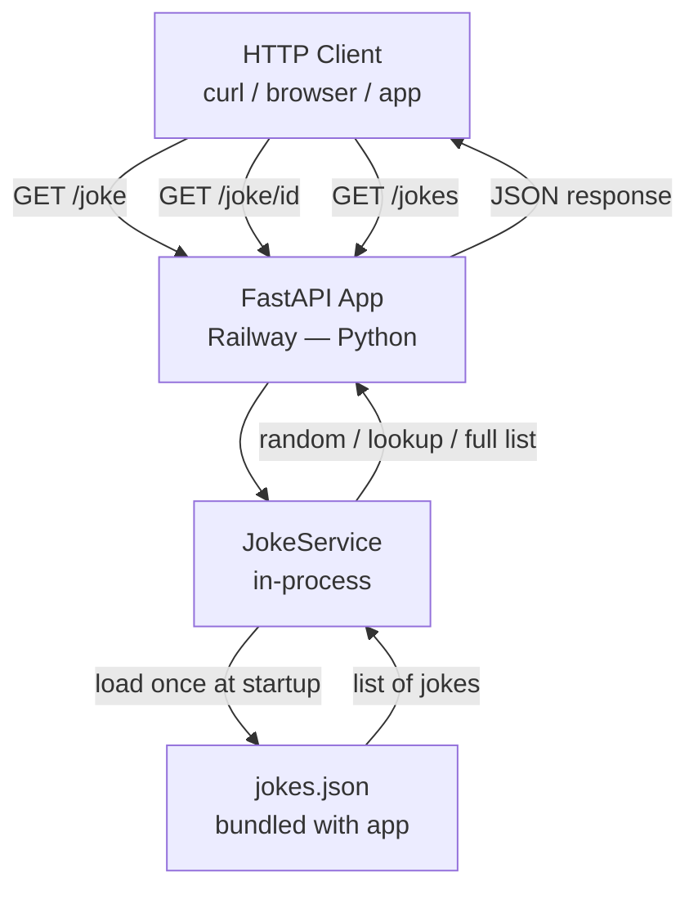

# System Architecture — Random Joke REST API

**Agent:** bjorn
**Date:** 2026-04-06
**Project:** test-autodispatch

## Upstream outputs read
_None required — this is a Phase 1 task and the first architecture deliverable for this project._

---

## Overview

A lightweight REST API that returns jokes on demand. Three endpoints: random joke, joke by ID, and full joke list. No database, no auth, no frontend. A 2-person team should be able to understand, deploy, and debug this at 2am with no runbook.

---

## System Diagram



---

## Tech Stack

| Layer | Choice | Reason |
|-------|--------|--------|
| Language | Python 3.11+ | Team default; FastAPI first-class support |
| Framework | FastAPI | Lightweight, typed, auto-docs at /docs |
| Joke storage | Static JSON file (bundled) | No DB, no cost, no migrations |
| In-memory index | Python dict keyed by joke id | O(1) lookup by ID; built at startup |
| Hosting | Railway | Team default for Python backends |
| CI/CD | Handled by Dag (see infrastructure deliverable) | Out of scope here |

---

## Data Model

Jokes are stored in `jokes.json`, bundled with the application at build time.

```json
[
  {
    "id": 1,
    "setup": "Why don't scientists trust atoms?",
    "punchline": "Because they make up everything.",
    "category": "science"
  }
]
```

| Field | Type | Description |
|-------|------|-------------|
| `id` | integer | Unique identifier, 1-based sequential |
| `setup` | string | The joke premise / question |
| `punchline` | string | The payoff |
| `category` | string | Tag for filtering (e.g. `science`, `programming`, `general`) |

**Minimum viable dataset:** 50 jokes across at least 3 categories. Arve should seed this file.

---

## Endpoint Design

### `GET /joke`

Returns one joke selected at random from the full dataset.

**Response — 200 OK**

```json
{
  "id": 7,
  "setup": "Why don't scientists trust atoms?",
  "punchline": "Because they make up everything.",
  "category": "science"
}
```

**Response — 500 Internal Server Error** (if jokes file is missing or empty)

```json
{
  "detail": "Joke source unavailable."
}
```

---

### `GET /joke/{id}`

Returns the joke with the given integer ID.

**Response — 200 OK** — same shape as above.

**Response — 404 Not Found**

```json
{
  "detail": "Joke not found."
}
```

**Response — 422 Unprocessable Entity** — FastAPI raises this automatically if `id` is not an integer.

---

### `GET /jokes`

Returns the full list of jokes. Supports optional `?category=<string>` query parameter to filter by category.

**Response — 200 OK**

```json
[
  {
    "id": 1,
    "setup": "...",
    "punchline": "...",
    "category": "programming"
  }
]
```

Returns an empty array if no jokes match the filter. Never returns 404 for an empty list.

---

## Error Handling Approach

- **Missing or unreadable jokes.json** — the app raises a 500 with `"detail": "Joke source unavailable."` FastAPI's exception handler covers this.
- **ID not found** — explicit 404 raised in the service layer, not allowed to propagate as a KeyError.
- **Invalid ID type** — FastAPI path parameter validation handles this automatically (422).
- **Unknown category filter** — returns an empty list (200), not a 404. Callers should not need to know which categories exist.

No global try/except wrapper. Errors are handled at the layer that can give a meaningful response.

---

## Architecture Decision Records

### ADR-1: Static JSON file, not a database

**Decision:** Store jokes in a bundled `jokes.json`, not in Supabase or any database.

**Rationale:** Jokes are read-only, curated content. There is no write path, no user ownership, and no query complexity beyond ID lookup and category filter. A database would add cost, latency, a migration surface, and a failure mode. A JSON file has none of these.

**Trade-off:** Adding jokes requires a redeploy. Acceptable at this scale.

**Reversibility:** Low risk — migrating to a DB later is straightforward if a write path (e.g. user submissions) is ever added.

---

### ADR-2: Random selection with `random.choice`, not deterministic

**Decision:** Use `random.choice(jokes)` for `GET /joke`. Do not seed the RNG by date.

**Rationale:** The project spec calls for a random joke. Unlike a daily quote, each request should have a chance of returning any joke. Determinism by date would defeat the purpose. `random.choice` is stdlib, requires no state, and is trivially testable by mocking.

**Trade-off:** The same joke may be returned twice in a row. Acceptable — the dataset is large enough that this is rare in practice.

**Reversibility:** Trivial to change selection strategy (weighted random, least-recently-seen) later.

---

### ADR-3: In-process dict index for ID lookup, not linear scan

**Decision:** At startup, build a `dict[int, Joke]` index from the JSON array. Serve `GET /joke/{id}` via dict lookup.

**Rationale:** Linear scan is O(n) per request. A dict built once at startup is O(1) for all subsequent lookups. 50–500 jokes is small enough that this dict fits in memory trivially.

**Reversibility:** No external dependency; replacing with DB lookup later is a one-line change in the service.

---

### ADR-4: No pagination on `GET /jokes`

**Decision:** Return all jokes in a single response. Do not add `limit`/`offset` or cursor pagination.

**Rationale:** A dataset of 50–500 jokes is small. The full list JSON is under 50 KB. Adding pagination adds complexity with no benefit at this scale.

**Trade-off:** If the dataset grows to thousands of jokes, pagination becomes necessary. At that point the static-file approach (ADR-1) would also need revisiting.

**Reversibility:** Adding pagination is non-breaking if done via optional query params with sensible defaults.

---

## Component Responsibilities (for Arve)

| Component | File | Description |
|-----------|------|-------------|
| App entrypoint | `main.py` | FastAPI app instance, lifespan hook to load jokes and build ID index |
| Router | `routers/joke.py` | `GET /joke`, `GET /joke/{id}`, `GET /jokes` handlers |
| Joke service | `services/joke_service.py` | Load JSON, build index, random selection, ID lookup, category filter |
| Joke data | `data/jokes.json` | Static array of `{ id, setup, punchline, category }` objects |
| Tests | `tests/test_joke.py` | Unit tests for selection + lookup logic; integration tests for all three endpoints |

---

## Out of Scope

- Authentication / API keys (public joke API)
- Admin interface for managing jokes (redeploy is the write path)
- Rate limiting (add if abuse occurs; Railway provides basic DDoS protection)
- Frontend (headless API)
- Versioning (`/v1/`) — add when a breaking change is needed
