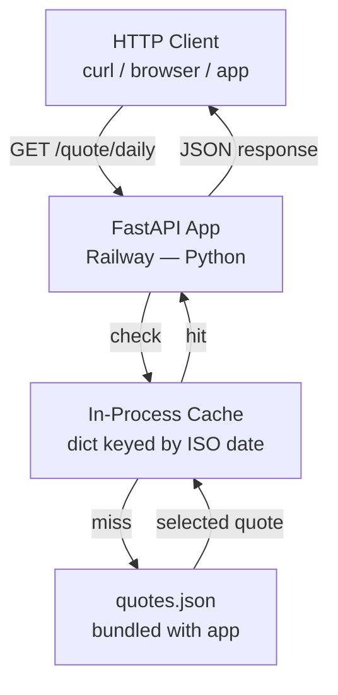

# System Architecture — Daily Motivational Quote API

**Agent:** bjorn
**Date:** 2026-04-06
**Project:** test-autodispatch

## Upstream outputs read
_None required — this is a Phase 1 task and is the first architecture deliverable for this project._

---

## Overview

A single-endpoint REST API that returns one motivational quote per calendar day. The system is intentionally minimal: no frontend, no database, no external dependencies beyond the framework itself. A 2-person team should be able to understand, deploy, and debug this at 2am with no runbook.

---

## System Diagram



---

## Tech Stack

| Layer | Choice | Reason |
|-------|--------|--------|
| Language | Python 3.11+ | Team default; FastAPI first-class support |
| Framework | FastAPI | Lightweight, typed, auto-docs at /docs |
| Quote storage | Static JSON file (bundled) | No DB, no cost, no migrations |
| Cache | In-process dict | Zero infra; process restarts once/day max |
| Hosting | Railway | Team default for Python backends |
| CI/CD | Handled by Dag (see dag task) | Out of scope here |

---

## Endpoint Design

### `GET /quote/daily`

Returns the quote for today's calendar date. The same quote is returned for all requests on the same UTC date.

**Response — 200 OK**

```json
{
  "quote": "The only way to do great work is to love what you do.",
  "author": "Steve Jobs",
  "date": "2026-04-06"
}
```

**Response — 500 Internal Server Error** (if quotes file is missing or empty)

```json
{
  "detail": "Quote source unavailable."
}
```

No authentication. No query parameters. No pagination. One endpoint, one job.

---

## Quote Sourcing Strategy

Quotes are stored in `quotes.json`, bundled with the application at build time. The file is a JSON array of objects:

```json
[
  { "quote": "...", "author": "..." },
  ...
]
```

**Selection algorithm:** deterministic by date.

```python
day_index = date.today().timetuple().tm_yday  # 1–366
quote = quotes[(day_index - 1) % len(quotes)]
```

This requires no state, no DB writes, and no cache invalidation logic. The same quote always maps to the same day-of-year, regardless of restarts.

**Minimum viable dataset:** 50–100 quotes covers the full year with rotation. Arve should seed the file with at least 50 entries.

---

## Caching Approach

Because selection is deterministic, a cache is optional but included as a guard against repeated file reads under load.

- **Type:** module-level Python dict (`{ "2026-04-06": <quote_object> }`)
- **Key:** ISO date string (`YYYY-MM-DD`)
- **Invalidation:** no explicit invalidation needed — a new key is written each day; old keys are harmless and negligible in size
- **Scope:** in-process; resets on restart (acceptable — restart cost is one file read)

This is not Redis. This is not Memcached. It does not need to be.

---

## Architecture Decision Records

### ADR-1: Static JSON file, not a database

**Decision:** Store quotes in a bundled `quotes.json`, not in Supabase or any database.

**Rationale:** Quotes are read-only, curated content. There is no write path, no user ownership, no need for queries. A database would add cost, latency, a migration surface, and a failure mode. A JSON file has none of these.

**Trade-off:** Adding quotes requires a redeploy. Acceptable at this scale.

**Reversibility:** Low risk — migrating to a DB later is straightforward if a write path (e.g. user submissions) is ever added.

---

### ADR-2: Deterministic day-of-year selection, not random

**Decision:** Select today's quote by `(day_of_year - 1) % len(quotes)`, not by random seed or DB row.

**Rationale:** All users see the same quote on the same day with no coordination. No shared state. No race conditions. Trivially testable by mocking `date.today()`.

**Trade-off:** Quotes rotate yearly, not randomly. Year-over-year the same date maps to the same quote. Acceptable — users are unlikely to notice.

---

### ADR-3: In-process cache, not external cache

**Decision:** Use a module-level Python dict. Do not introduce Redis or a sidecar cache.

**Rationale:** Traffic volume at launch does not justify Redis. A dict costs nothing and handles thousands of RPS on a single Railway instance. If load increases, a horizontal scale-out is possible without changing the cache design (each process independently computes the same result).

**Reversibility:** Trivial to swap in Redis later by replacing the dict lookup with a Redis GET/SET.

---

### ADR-4: UTC date for daily boundary

**Decision:** Use `datetime.utcnow().date()` (or `datetime.now(timezone.utc).date()`) to determine "today."

**Rationale:** The API has no concept of user timezone. A consistent global boundary avoids off-by-one issues across timezones and is easy to reason about in logs.

**Trade-off:** Users in UTC+14 (e.g. Kiribati) see a new quote 14 hours before UTC-12 users. Acceptable for a motivational quote.

---

## Component Responsibilities (for Arve)

| Component | File | Description |
|-----------|------|-------------|
| App entrypoint | `main.py` | FastAPI app instance, lifespan hook to load quotes |
| Router | `routers/quote.py` | `GET /quote/daily` handler |
| Quote service | `services/quote_service.py` | Load JSON, select by date, cache |
| Quote data | `data/quotes.json` | Static array of `{ quote, author }` objects |
| Tests | `tests/test_quote.py` | Unit tests for selection logic; integration test for endpoint |

---

## Out of Scope

- Authentication / API keys (not needed for a public quote API)
- Admin interface for managing quotes (redeploy is the write path)
- Rate limiting (Railway provides basic DDoS protection; add if abuse occurs)
- Versioning (`/v1/`) (add when a breaking change is needed)
- Frontend (this is a headless API)
