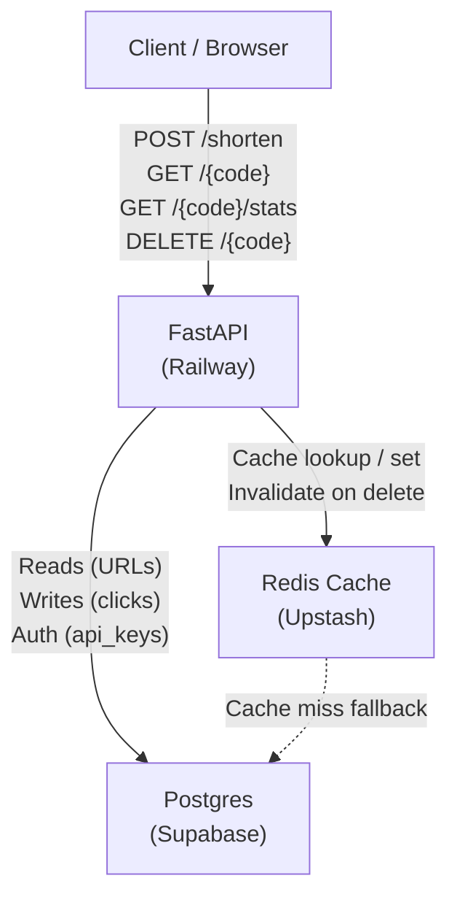
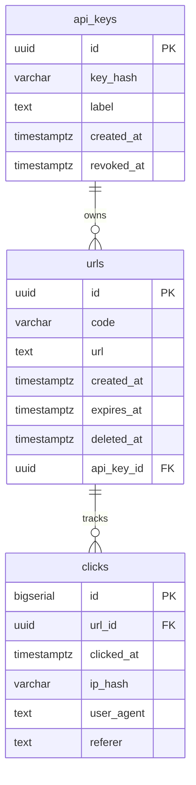

# System Architecture — URL Shortener API

**Agent:** bjorn  
**Date:** 2026-04-01  
**Project:** test-handoffs

---

## Overview

A Python REST API for a URL shortener. Small team maintainability is the primary constraint — no clever distributed systems, no premature optimization. Stateless API + Postgres for persistence + Redis for redirect caching.

---

## Tech Stack Decisions

| Layer | Choice | Reason |
|-------|--------|--------|
| Framework | FastAPI | Async support, auto-generated OpenAPI docs, Python type hints |
| Database | Postgres (Supabase) | Relational model fits URL + click data; hosted Postgres removes ops burden |
| Cache | Redis (Upstash) | Serverless Redis — zero infra, pay-per-use; fast redirect lookup avoids DB hit on every GET |
| Hosting | Railway | Matches Bjørn's standard stack; simple deploys, no k8s needed |
| Auth | API key via `X-Api-Key` header | Simple enough for v1; avoids OAuth complexity for a 2-person team |

**Hard-to-reverse decisions:**
- Short codes are treated as permanent identifiers once issued. Changing the code generation algorithm would break existing links — the algorithm is locked at v1.
- Redis is used as a read-through cache for redirect lookup. If Redis is removed later, every redirect hits Postgres. This is fine at low scale but worth noting.

---

## Short Code Generation Strategy

- 7-character base-62 string (a-z, A-Z, 0-9) = ~3.5 trillion possible codes
- Generated by: `secrets.token_urlsafe(6)[:7]` (cryptographically random, URL-safe subset)
- On collision: retry up to 3 times, then raise 500
- Collision probability at 1M codes: ~0.014% — acceptable for v1

Custom aliases are supported: user can pass `?alias=my-slug`. Aliases must match `[a-zA-Z0-9_-]{3,50}`.

---

## API Endpoint Structure

### `POST /shorten`
Create a short URL.

**Request:**
```json
{
  "url": "https://example.com/very/long/path",
  "alias": "optional-custom-slug",
  "expires_at": "2026-12-31T00:00:00Z"
}
```

**Response `201`:**
```json
{
  "code": "aB3xY7z",
  "short_url": "https://short.example.com/aB3xY7z",
  "url": "https://example.com/very/long/path",
  "expires_at": null,
  "created_at": "2026-04-01T12:00:00Z"
}
```

### `GET /{code}`
Redirect to the original URL. Returns HTTP 302. Increments click counter async (fire-and-forget write to Postgres). Checks Redis first; falls back to Postgres on cache miss.

**Response `302`:** `Location: https://example.com/...`  
**Response `404`:** code not found  
**Response `410`:** code expired

### `DELETE /{code}`
Soft-delete a short URL. Sets `deleted_at` timestamp. Requires `X-Api-Key` header.

**Response `204`:** deleted  
**Response `404`:** not found

### `GET /{code}/stats`
Return click analytics for a short URL.

**Response `200`:**
```json
{
  "code": "aB3xY7z",
  "url": "https://example.com/...",
  "total_clicks": 142,
  "clicks_by_day": [
    { "date": "2026-04-01", "count": 42 }
  ],
  "created_at": "2026-04-01T12:00:00Z",
  "expires_at": null
}
```

---

## Data Models

### `urls` table

| Column | Type | Notes |
|--------|------|-------|
| `id` | `uuid` PK | `gen_random_uuid()` |
| `code` | `varchar(50)` UNIQUE NOT NULL | Short code or custom alias |
| `url` | `text` NOT NULL | Original long URL |
| `created_at` | `timestamptz` | Default `now()` |
| `expires_at` | `timestamptz` | Nullable; NULL = never expires |
| `deleted_at` | `timestamptz` | Nullable; soft delete |
| `api_key_id` | `uuid` FK → `api_keys.id` | Owner of this link |

Indexes:
- `urls_code_idx` on `code` (unique, used on every redirect)
- `urls_api_key_id_idx` on `api_key_id`

### `clicks` table

| Column | Type | Notes |
|--------|------|-------|
| `id` | `bigserial` PK | High-volume writes; bigserial avoids UUID overhead |
| `url_id` | `uuid` FK → `urls.id` | |
| `clicked_at` | `timestamptz` | Default `now()` |
| `ip_hash` | `varchar(64)` | SHA-256 of client IP; no raw PII stored |
| `user_agent` | `text` | Nullable |
| `referer` | `text` | Nullable |

Indexes:
- `clicks_url_id_clicked_at_idx` on `(url_id, clicked_at)` — used for stats aggregation

### `api_keys` table

| Column | Type | Notes |
|--------|------|-------|
| `id` | `uuid` PK | |
| `key_hash` | `varchar(64)` | SHA-256 of raw key; raw key shown once at creation |
| `label` | `text` | Human-readable name |
| `created_at` | `timestamptz` | |
| `revoked_at` | `timestamptz` | Nullable; soft revoke |

---

## Redirection Flow

```
Client GET /{code}
       │
       ▼
   FastAPI handler
       │
       ├─► Redis CACHE CHECK (key: "url:{code}")
       │         │
       │    HIT  │  MISS
       │         │    │
       │         │    ▼
       │         │  Postgres SELECT urls WHERE code = ?
       │         │    │
       │         │    ├─ Not found → 404
       │         │    ├─ Deleted   → 404
       │         │    ├─ Expired   → 410
       │         │    └─ Found     → Cache in Redis (TTL 1h)
       │         │
       │    ◄────┘
       │
       ├─► Fire-and-forget: async INSERT INTO clicks
       │
       └─► HTTP 302 → Location: <original_url>
```

Cache invalidation: on `DELETE /{code}`, remove key from Redis immediately.

---

## Component Architecture



---

## Data Model ERD



---

## Folder Structure (for Arve)

```
app/
├── main.py              # FastAPI app entrypoint, route registration
├── config.py            # Settings via pydantic-settings (env vars)
├── database.py          # Async SQLAlchemy engine + session factory
├── cache.py             # Redis client wrapper
├── models/
│   ├── url.py           # SQLAlchemy ORM: urls table
│   ├── click.py         # SQLAlchemy ORM: clicks table
│   └── api_key.py       # SQLAlchemy ORM: api_keys table
├── schemas/
│   ├── url.py           # Pydantic request/response schemas
│   └── stats.py         # Pydantic stats response schema
├── routers/
│   ├── shorten.py       # POST /shorten
│   ├── redirect.py      # GET /{code}
│   ├── delete.py        # DELETE /{code}
│   └── stats.py         # GET /{code}/stats
├── services/
│   ├── codegen.py       # Short code generation logic
│   └── auth.py          # API key validation dependency
└── migrations/          # Alembic migration files
```

---

## Environment Variables

| Variable | Description |
|----------|-------------|
| `DATABASE_URL` | Supabase Postgres connection string |
| `REDIS_URL` | Upstash Redis connection string |
| `BASE_URL` | Public base URL (e.g. `https://short.example.com`) |
| `REDIS_TTL_SECONDS` | Cache TTL for redirect lookups (default: `3600`) |

---

## Open Questions / Deferred Decisions

- **Rate limiting**: Not in v1. Can be added at the Railway reverse proxy layer later.
- **Analytics retention**: `clicks` table will grow unbounded. Archive or partition after 90 days in a future sprint.
- **Multi-tenancy**: v1 is single-tenant (one API key = one owner). Multi-org support deferred.
- **Custom domains**: Deferred. The `BASE_URL` env var is the only short domain for now.
